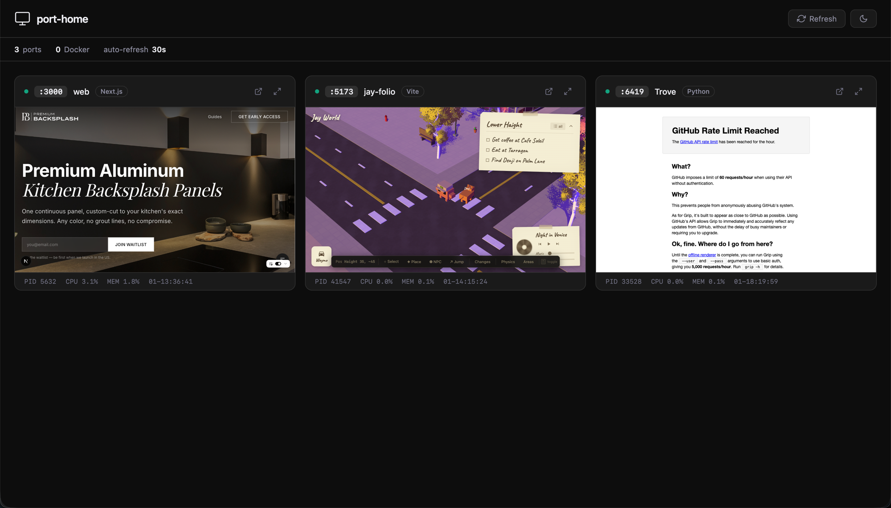

# port-hub

Browser dashboard that shows all your local dev server ports as live iframe tiles.



## Features

- Scans listening TCP ports and filters out system/desktop apps — only shows dev servers and Docker containers
- Detects 25+ frameworks (Next.js, Vite, Django, Rails, Express, etc.) and Docker services (PostgreSQL, Redis, etc.)
- Live iframe preview of each running service
- Click to expand any tile full-screen, or open in a new tab
- Shows PID, CPU, memory, and uptime per process
- Dark/light mode
- Auto-refreshes every 30s when the tab is focused, pauses when hidden

## Usage

```bash
npx port-hub         # run directly, no install
npx port-hub 8080    # custom port
```

Or install globally:

```bash
npm i -g port-hub
port-hub
```

Zero dependencies. Requires Node.js and macOS (`lsof`).

## How it works

1. Runs `lsof -iTCP -sTCP:LISTEN` to find all listening ports
2. Gets process details via `ps` and working directory via `lsof -d cwd`
3. Detects the framework from the command string and `package.json` dependencies
4. Walks up from the process cwd to find the project root and name
5. Serves a single-page dashboard with scaled-down iframe previews of each port
